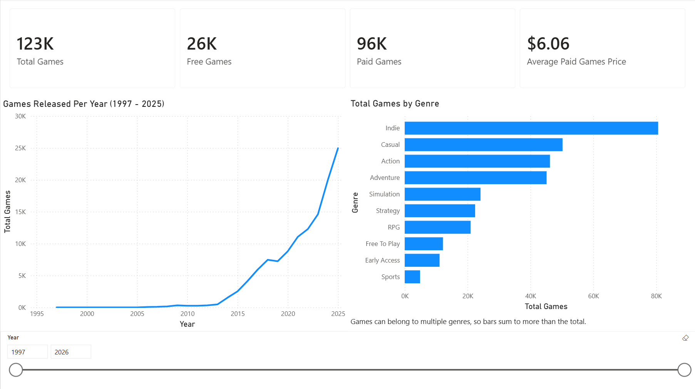
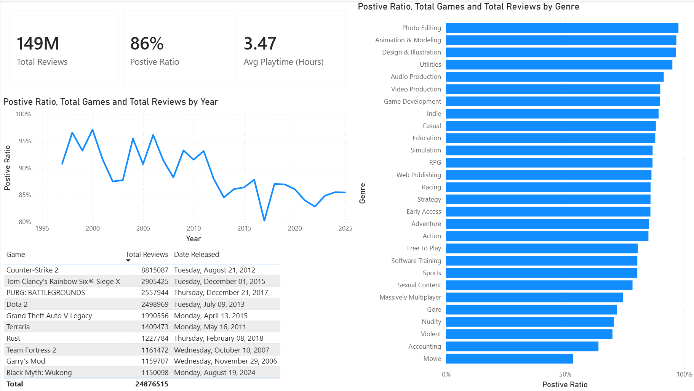

# Steam Games ETL Pipeline

This project builds an ETL pipeline for a Steam games dataset from Kaggle, loads cleaned and standardized data into a PostgreSQL database, and reports on it through a Power BI dashboard.

The pipeline supports **CSV and JSON** input formats, applies data cleaning and schema standardization, and loads the data into a **normalized PostgreSQL schema** using upsert logic for the main and lookup tables plus bridge-table loading for many-to-many relationships. A separate **star schema semantic model** sits on top of that database in Power BI for reporting.

Source:  
https://www.kaggle.com/datasets/fronkongames/steam-games-dataset/data

## Project Goal

The goal of this project is to practice and demonstrate core data engineering and analytics skills through a structured ETL workflow:

- extracting data from raw **CSV and JSON** sources
- cleaning messy real-world data
- transforming different source formats into a unified schema
- converting values into database-ready types
- normalizing one large flat dataset into relational tables
- loading cleaned data into PostgreSQL using **upsert** logic
- loading many-to-many bridge tables for repeated/list-like attributes
- validating the loaded data with SQL
- modeling the same data as a **star schema** for analytical reporting
- improving maintainability with modular pipeline components and environment-based configuration

## Tech Stack

- Python
- pandas
- NumPy
- PostgreSQL
- pgAdmin 4
- SQLAlchemy
- psycopg2
- Power BI (Power Query, DAX)
- Git / GitHub

## Current Pipeline Version

### V3 — Normalized Schema

The pipeline now loads data into a normalized relational design instead of a single flat table.

### Main table
- `steam_games`

### Lookup tables
- `languages`
- `developers`
- `publishers`
- `categories`
- `genres`

### Bridge tables
- `game_supported_languages`
- `game_full_audio_languages`
- `game_developers`
- `game_publishers`
- `game_categories`
- `game_genres`

## Key Features

- Supports **two input formats**:
  - CSV
  - JSON
- Modular ETL workflow:
  - extract
  - transform
  - load
  - validate
- JSON-to-tabular transformation aligned with the CSV pipeline structure
- Data cleaning for:
  - empty strings
  - empty lists
  - list-like text fields
  - messy language values
  - numeric/date conversion
- Splits `estimated_owners` into:
  - `estimated_owners_min`
  - `estimated_owners_max`
- Normalizes repeated text fields into lookup tables
- Builds bridge tables for many-to-many relationships
- PostgreSQL upsert logic for:
  - main table
  - lookup tables
- Bridge table loading with conflict-safe inserts
- Duplicate handling using:
  - `game_id` for the main table
  - unique text columns for lookup tables
  - composite keys for bridge tables
- Environment-based database credentials using `.env`
- Console and file logging for pipeline monitoring and debugging

## Data Modeling Improvements in V3

Compared to the earlier flat-table design, V3 improves the schema by:

- splitting one large table into multiple related tables
- reducing repeated text values
- properly modeling many-to-many relationships
- separating list-like attributes into lookup and bridge tables
- making the database easier to query and maintain

## Example Transform Flow

The transform step now includes:

1. rename source columns
2. select required columns
3. normalize empty values
4. log and fill missing game names
5. normalize list-like fields into Python lists
6. clean language fields
7. convert numeric and date columns
8. split estimated owners into min/max columns
9. build:
   - `steam_games` dataframe
   - lookup table dataframes
   - bridge table dataframes

## Load Flow

The load step now works in three stages:

1. upsert the `steam_games` table
2. upsert lookup tables
3. load bridge tables by mapping lookup values to lookup IDs

Missing values are converted from `np.nan` to `None` at the DataFrame-to-records boundary so they land in PostgreSQL as real SQL `NULL`s rather than as `'NaN'` strings.

## Data Quality Handling

Two issues found while validating the loaded data, both fixed at the source rather than worked around downstream:

**`NaN` written instead of `NULL`.** pandas uses `np.nan` as its missing-value marker, but psycopg cannot convert a float `NaN` into SQL `NULL` — in text columns such as `metacritic_url` it landed as the literal three-character string `'NaN'`. That silently passed every `IS NULL` check and made the column look 100% populated. Fixed with a single conversion at the load boundary; the transform layer still uses `np.nan` throughout, as intended.

**A game with no name.** One record (`game_id` 396420) has no name in the source data — a real, published Steam title whose developer only supplied Japanese metadata. Rather than dropping the row or relaxing the `NOT NULL` constraint, the pipeline logs every affected `game_id` and fills the name with a traceable placeholder (`[UNNAMED - game_id X]`), so unusual-but-real data is preserved and identifiable.

## Dashboard

The Power BI report is built on a **star schema semantic model** layered over the normalized database.

### Catalog Overview

How large Steam's catalog is, what is in it, and what it costs.



### Reception

How the catalog is rated and how much of it people actually play.



### Why two different schemas

The PostgreSQL schema and the Power BI model describe the same data but are optimized for opposite workloads.

The **database** is normalized: it is written to by the pipeline, so it prioritizes storage efficiency and referential integrity. Repeated values live once in lookup tables, and many-to-many relationships are expressed through bridge tables with composite primary keys and cascading foreign keys.

The **semantic model** is a star schema: it is read from by report visuals, so it prioritizes fast aggregation and predictable filter propagation. `steam_games` becomes the fact table, and the lookup tables become dimensions.

Because a game genuinely can have several genres, categories, developers, publishers, and languages, the many-to-many relationships cannot be collapsed into direct one-to-many joins. The bridge tables are therefore carried into the model, with each dimension filtering its bridge in a single direction and each bridge relating to the fact table with **bidirectional cross-filtering** so a dimension filter can propagate through to the fact table.

Because `languages` serves two distinct purposes — supported languages and full audio languages — it is implemented as a **role-playing dimension**, split into two copies so that each has exactly one unambiguous filter path to the fact table. A single shared dimension would create two competing propagation paths and produce unreliable results.

A dedicated `DimDate` table is generated with `CALENDARAUTO()` and marked as the model's date table, keeping time attributes out of the fact table and enabling time intelligence.

### Measures

Defined in a dedicated `_Measures` table:

| Measure | Description |
|---|---|
| Total Games | Row count of the fact table |
| Free Games | Games priced at 0 |
| Paid Games | Games priced above 0 |
| Average Price | Mean price across all games |
| Average Paid Games Price | Mean price excluding free games |
| Total Reviews | Positive plus negative review counts |
| Positive Ratio | Positive reviews as a share of all reviews |
| Avg Playtime (Hours) | Mean lifetime playtime, converted from minutes |

### Known data caveats

These are properties of the source data, and are surfaced in the report rather than hidden:

- **Genre totals exceed the game count.** A game can belong to multiple genres, so it is counted once per genre it qualifies for. Individual bars are correct; their sum is not meaningful.
- **Partial years are excluded from trends.** The dataset was captured mid-year, so an `Is Complete Year` flag in `DimDate` compares each year against the latest release date present in the data and excludes years the data does not fully cover. Chart titles report the actual range shown.
- **Rating charts are filtered by review volume.** A game with a handful of reviews can post a perfect score, so the top-rated table applies a minimum review threshold, stated in the visual title.
- **The rating trend is by release year, not review date.** Reviews carry no timestamp in this dataset, so the trend describes how games released in a given year are rated today — not how sentiment changed over time.

## Project Structure

```text
steam_games_etl/
├── data/
│   ├── raw/
│   │   ├── games.csv
│   │   └── games.json
│   └── cleaned/
├── images/
│   ├── Catalog.png
│   └── Reception.png
├── logs/
│   └── etl_pipeline.log
├── scripts/
│   ├── config.py
│   ├── extract.py
│   ├── load.py
│   ├── logger_config.py
│   ├── main.py
│   ├── test_connection.py
│   ├── transform.py
│   └── validate.py
├── sql/
│   └── create_steam_games_table.sql
├── .env
├── .gitignore
├── README.md
└── requirements.txt
```
